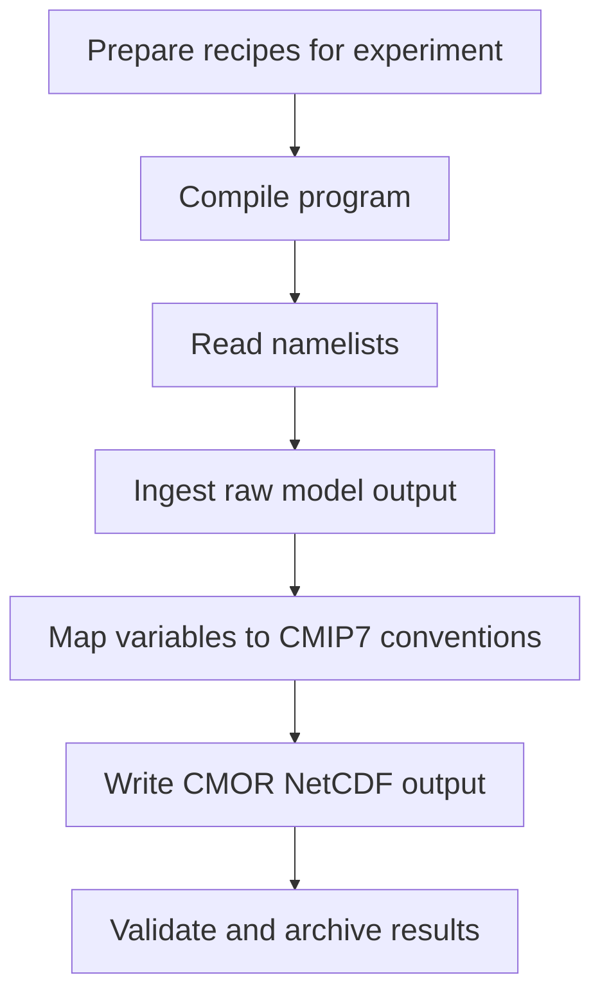
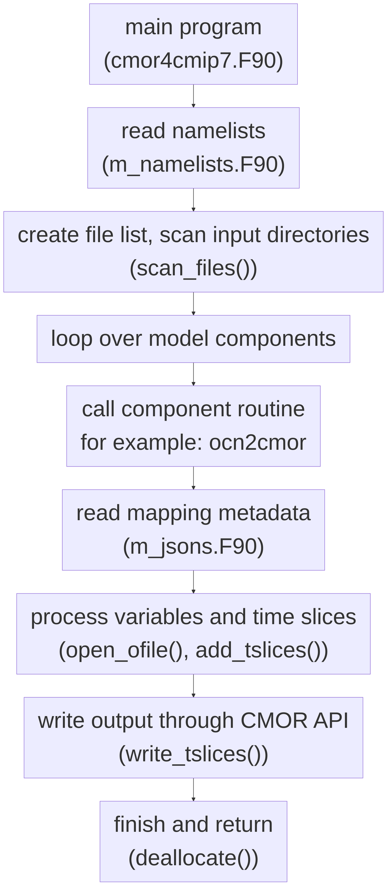
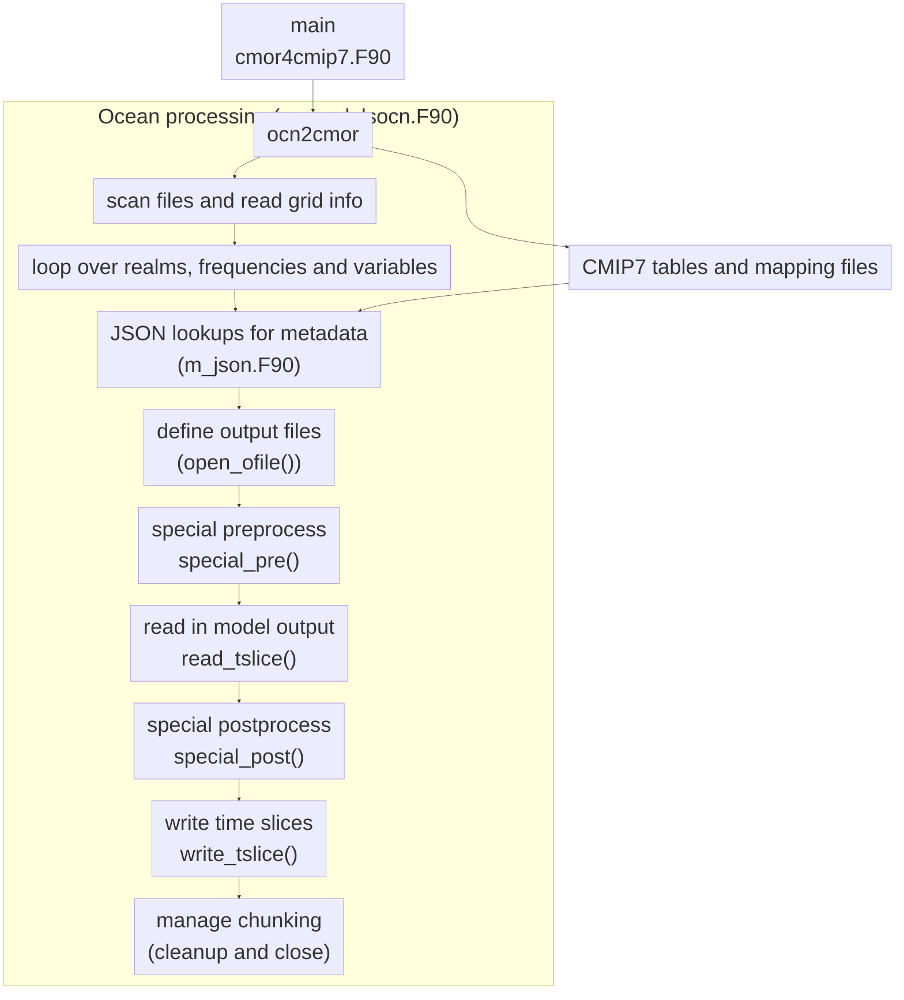

# Flowchart

This page describes the workflow of the program in different level of details, from overall CMOR workflow to the specific processing steps.

## 1. General workflow

General workflow: the overall data path from recipe to validated output.

The top-level view is a recipe-driven pipeline: configuration files define the experiment, model metadata, runtime directories, and target variables; the program reads these inputs and writes CMIP7-compliant output.

## 2. Program-level flow

Program-level flow: how the executable coordinates the runtime steps.

At the program level, `cmor4cmip7.F90` acts as the entry point. It loads the configuration, builds the file list, dispatches to model-specific processing routines, and loop through the list of variables, write out CMIP7-compliant datasets until all required variables are processed.

## 3. Detailed ocean processing flow

Detailed component flow: how one model component translates native fields into CMIP7 variables.

The ocean path is a representative example of how a component routine converts native output into CMIP7 output. The logic reads the relevant input files, looks up the target metadata, applies preprocessing and postprocessing, and writes the values through the CMOR interface.

## 5. Typical processing workflow

The actual variable conversion pattern is usually:

1. discover the native file and grid metadata;
2. identify the target CMIP7 variable and its associated metadata;
3. read the source model field(s);
4. apply any preprocessing or derivation required by the mapping;
5. convert units, dimensions, and time axes to the CMIP7 convention;
6. write the result through the CMOR API.

This pattern repeats for each variable and time slice of different realm, frequency, and region until the run is complete.
